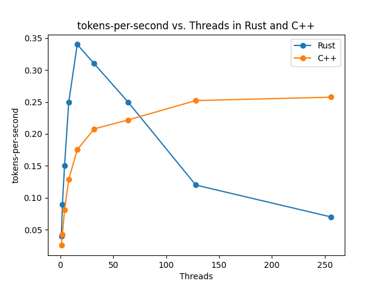
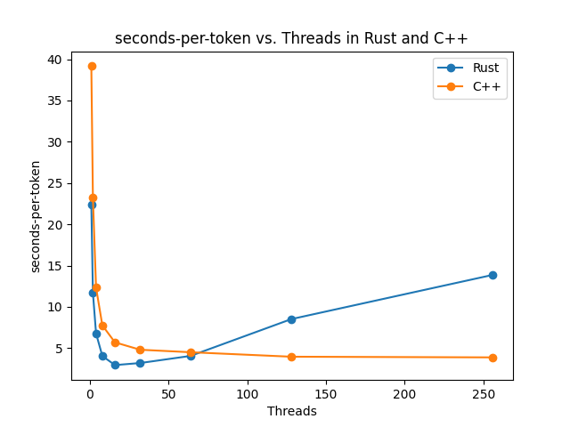
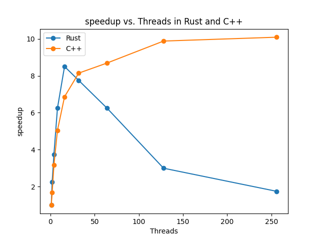

##  GPTX: A simple implementation of GPT-2 in Rust and CPP on CPU

[[ View on Github ]](https://github.com/arunpatro/gptx)

In this project, we benchmark Rust and CPP implementation of multiprocessing features and report the metrics as we increase threads. 

### Machine Details
We benchmark on the NYU HPC crunchy-5 machine with the configuration of 64 cores, 256GB memory. 

### Results

