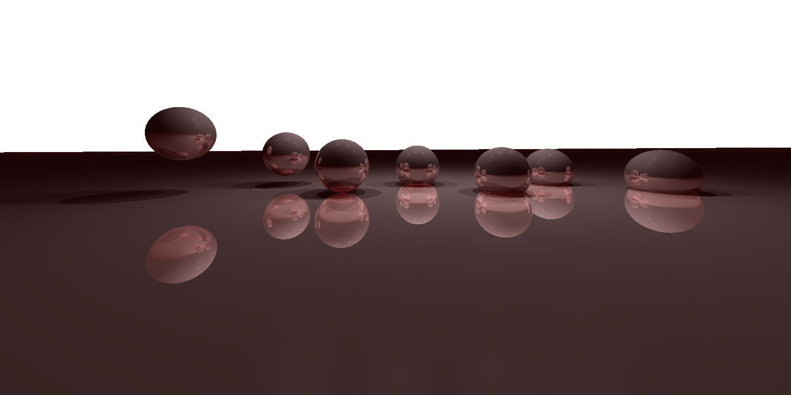

## benchmaring rust-vs-cpp for ray tracing

### Introduction
The graphics class at NYU was a great motivation for me to dive deep into compiled languages like `C++` and `Rust`. I implement simple raytracing scenes in cpp (class default) and later in rust by trying to replicate similar code structure albeit a few obv differences like `OOP` vs `Trait-Impl`. 

I profile both code to find out the pros/cons of coding in either language. Cpp is the baseline.


`C++` code uses `Eigen` for numerical computing. `Rust` uses the `nlalgebra` crate. 

### Observations
We observe that 
1. cpp compiles faster, produces a smaller binary and is faster
2. rust is easier to debug
3. floating point math is inaccurate and gives different intermediate results for both
4. using link time optimization in rust gives faster compile time, runtime and smaller binary

### [Image 01]: Reflection with 7 Spheres and 1 Plane


```
Objects: 7 Spheres and 1 Plane
Material: Reflective and Specular
Camera: fov: 45, focal length = 5, position = (0, 1, 10), Perspective
Sensor Size: 1600x800 pixels
```

Benchmarking results:
|      | compile time | runtime 1600x800 | runtime 2400x1200 | binary size |
|------|--------------|------------------|-------------------| ----------- |
| C++  | 6.077s       | 3.110s            |   6.728s           | 109KB      |
| Rust | 1m 23s       | 1.567s            |   2.778s           | 1.5MB      |
| Rust (LTO) | 54.227s | 3.101s | 6.914s | 760KB |
