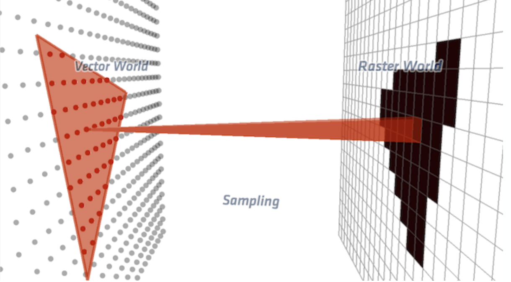

## benchmaring `rust`-vs-`cpp` for graphics

<!-- Add an image here  -->

<!-- Resources
https://docs.google.com/spreadsheets/d/1OQ_U8fY8DCzwz8CoYbobhHeJ4oKW49x4uOhf4Yy9mwU/edit#gid=0 -->


### Introduction
The graphics class at NYU was a great motivation for me to play with compiled languages like `C++` and `Rust`. Here, I write 3 simple graphics programs in cpp (class default) and rewrite them in rust. I try to to replicate similar code structure, fp precision, types. But there remain obv differences in the programming philosophy like `OOP` vs `Struct-Impl-Trait`/`Functional`. This benchmark is purely on a CPU - `i7-1068NG7`. GPUs involve Shading Languages and more thoughtful logic. I would also like to extend these studies to modern graphics tech like `webgpu`, `vulcan`, `metal-3` and also target the `wasm` architecture.

### Tasks
We deal with 3 tasks:
1. Ray Tracing (3 images)
2. Ray Tracing with BVH accelaration (2 objects)
3. Rasterization on CPU (2 videos)

### TLDR
Rust is faster. 

<hr>

### 1> Ray Tracing


What is Ray Tracing? 
```
Ray Tracing involves simulating light rays and their interactions with objects, to model how it may appear in real life. The trick here is to start the ray as originating from a camera onto the screen which hits objects thereby determining the color.

This is very intensive computation which is usually CPU bound. It may be parallelized, because each pixel value is independent of others. 
```

We render the following image which consists of 7 spheres, 1 plane and 7 lights. Objects are of lambert, specular and reflective materials, which determine their color calculation.


Benchmarking results:
<table>
  <thead>
    <tr>
      <th></th>
      <th>compile time</th>
      <th>runtime 1600x800</th>
      <th>runtime 2400x1200</th>
      <th>binary size</th>
    </tr>
  </thead>
  <tbody>
    <tr>
      <td>C++</td>
      <td>6.077s</td>
      <td>3.110s</td>
      <td>6.70 +- 0.46s</td>
      <td>109KB</td>
    </tr>
    <tr>
      <td>C++ (G++ LTO)</td>
      <td>-</td>
      <td>-</td>
      <td>4.60 +- 0.49s</td>
      <td>70KB</td>
    </tr>
    <tr>
      <td>Rust</td>
      <td>1m 23s</td>
      <td>1.567s</td>
      <td>2.778s</td>
      <td>1.5MB</td>
    </tr>
    <tr>
      <td>Rust (LTO)</td>
      <td>54.227s</td>
      <td>3.101s</td>
      <td>6.914s</td>
      <td>760KB</td>
    </tr>
    <tr>
      <td>Rust (Thin LTO)</td>
      <td>1m 15s</td>
      <td>2.056s</td>
      <td>4.170s</td>
      <td>1.4MB</td>
    </tr>
  </tbody>
</table>

<hr> 

### 2> Ray Tracing with BVH accelaration


What is Bounding Volume Heirarchy (BVH)? 
```
Complex geometries can be represented as a collection of primitive elements like triangles. When the scene has many objects, intersecting a ray with all the objects can be really intensive. It can help to recursively partition the space or the object into heirarchies, and only recursively search the partition the ray intersects. This can help in acheiving a logarithmic computation time. 

BVH is datastructure for acceleration that subdivides the objects (instead of space). We create a Axis-Aligned-Bounding-Box (AABB) for each object and group them together using a bottom-up approach. 
```

We render the following dragon which consists 856294 triangles. For this task, we slightly modify the code and assume assume all lights are visible, ignoring shadow rays. This assumption simplifies this task. (Note: One may need to additionally comment 2 LOC in rust)


Benchmarking results:
<table>
  <thead>
    <tr>
      <th></th>
      <th>compile time</th>
      <th>runtime 1600x800</th>
      <th>runtime 2400x1200</th>
      <th>binary size</th>
    </tr>
  </thead>
  <tbody>
    <tr>
      <td>C++</td>
      <td>6.077s</td>
      <td>3.110s</td>
      <td>6.70 +- 0.46s</td>
      <td>109KB</td>
    </tr>
    <tr>
      <td>C++ (G++ LTO)</td>
      <td>-</td>
      <td>-</td>
      <td>4.60 +- 0.49s</td>
      <td>70KB</td>
    </tr>
    <tr>
      <td>Rust</td>
      <td>1m 23s</td>
      <td>1.567s</td>
      <td>2.778s</td>
      <td>1.5MB</td>
    </tr>
    <tr>
      <td>Rust (LTO)</td>
      <td>54.227s</td>
      <td>3.101s</td>
      <td>6.914s</td>
      <td>760KB</td>
    </tr>
    <tr>
      <td>Rust (Thin LTO)</td>
      <td>1m 15s</td>
      <td>2.056s</td>
      <td>4.170s</td>
      <td>1.4MB</td>
    </tr>
  </tbody>
</table>

<hr>

### 3> Rasterization on CPU

What is Rasterization? 

```
Ray tracing can be computationally intense. A trick to improve is to project the objects onto the camera plane. In this process we discretize the vector objects into pixels. This task is highly parallelizable, and can leverage GPUs. Rasterization is quite an involved pipeline and consists of Vertex, Geometry, Fragment and Blending Shaders. Each of these shaders are restrictive in what they do and hence are very  efficiently parallelizable. 
```
The above dragon is re-rendered much faster!

<!--  -->

Benchmarking results:
<table>
  <thead>
    <tr>
      <th></th>
      <th>compile time</th>
      <th>runtime 1600x800</th>
      <th>runtime 2400x1200</th>
      <th>binary size</th>
    </tr>
  </thead>
  <tbody>
    <tr>
      <td>C++</td>
      <td>6.077s</td>
      <td>3.110s</td>
      <td>6.70 +- 0.46s</td>
      <td>109KB</td>
    </tr>
    <tr>
      <td>C++ (G++ LTO)</td>
      <td>-</td>
      <td>-</td>
      <td>4.60 +- 0.49s</td>
      <td>70KB</td>
    </tr>
    <tr>
      <td>Rust</td>
      <td>1m 23s</td>
      <td>1.567s</td>
      <td>2.778s</td>
      <td>1.5MB</td>
    </tr>
    <tr>
      <td>Rust (LTO)</td>
      <td>54.227s</td>
      <td>3.101s</td>
      <td>6.914s</td>
      <td>760KB</td>
    </tr>
    <tr>
      <td>Rust (Thin LTO)</td>
      <td>1m 15s</td>
      <td>2.056s</td>
      <td>4.170s</td>
      <td>1.4MB</td>
    </tr>
  </tbody>
</table>


### Observations
1. rust is faster!
1. cpp compiles faster
2. cpp produces a smaller binary
3. link-time-optimization (LTO) in rust is faster to compile than rust without LTO ??
4. Rust with LTO is slower than without LTO ??
5. How can thin LTO be faster than fat LTO ??


### Additional Comments
- Rust is more pleasant to code in than cpp, because of modern tooling. 
- I think rust is faster because it enforces a better memory management system and a better zero-cost-abstraction. 
- Rust uses `nlagebra`, CPP uses `Eigen`. These Eigen files are all header files and therefore could be the reason why there are fewer library files to compile. 