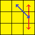
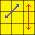

## An intuitive guide to solving a Rubik's cube using only 1 algorithm

### Introduction
>This tutorial may take 2 weeks. --Arun

Solving the rubik's cube on your own can be very tricky. However after learning the fundamentals and mechanics of one, it will seem approachable. Learning a bunch of algorithms by rote and then muscle memory helped me feel the solving process banal. 

The process to solve the cube is straightforward, algorithmically. Rote learning easy. The more algorithms you know -> More shortcut cases -> The faster you can solve. But it shouldn't be this way. I like to think that solving a rubik's cube a.k.a. the cube can be visualized in a different and more intuitive way. This method is also used to solve the cube blind folded. 

I want to discuss the Old Pochman method to the audience. This method can help you visualize the movements of pieces of a rubik's with ease even if you are a beginner. 

Check out my Old Pochman sequence generator a.k.a. `alpha-algo` @ https://github.com/arunpatro/alpha-algo

**Permuting** refers to moving pieces that change position. When you permute 4 pieces, you keep the whole cube constant, and interchange only those. Old Pochman method can implemented by knowing just 1 algorithm. The OP solution is just permuting a set of 4 pieces over and over again to get all the pieces in the right orientation and place. 

### Fundamentals + Mechanics
>"Basic cube facts for true beginners" by Lars: https://lar5.com/cube/begin.html

A rubik's cube also referred to as a `3x3x3` doesn't have 27 minicubes as what might seem. A rubik's cube just has 20 movable pieces. An unsolved/scrambled rubik's cube is just those 20 pieces in different positions and orientations. 

A cube has 6 faces, 12 edges and 8 corners. So a Rubik's cube has 6 center pieces, 12 edge pieces, and 8 corner pieces. The centers never move. Hence there are 12 edge pieces and 8 corner pieces that move around. 

Edge pieces have two colors representing the edge they belong to. An `orange-blue` edge piece belongs to the space between the orage and the blue centers. However, the space between the orange and the blue center might contain a `red-green` edge piece (or any other different). 

Corner pieces have three colors representing the corner they belond to. An `orange-blue-white` corner piece belongs to the space between the orange, the blue and the white corner. However, the space between them might contain a `green-red-white` corner piece (or any other different).

Each center piece represents the color of the whole face. A red piece is what represents the red face and is surrounded by 4 edge pieces and 4 corner pieces that are oriented to have their red color next to the red center piece. This completes the face. 

Each rotation of a side/face, permutes 8 pieces: 4 corner and 4 edge pieces, causing chaos. We must use this chaos to create complete crystal order!

### Notation
Pieces (both edge and corners) are the building blocks of arrangement and chaos in the rubik's cube. We must move them by rotating sides/faces i.e. we must move 8 pieces at once everytime we move. 

> Always keep the cube orientation fixed for the entirety of the process i.e. color-face notations are same.

> I suggest orienting cube so that `yellow` is `UP` face and `orange` is `FRONT` face. The rest of the orientation can derived to be: `blue` is `RIGHT` face, `red` is `BACK` face, `green` is `LEFT` face and `white` is `DOWN` face. 

The notation for rotating the cube keeping the relative orientations of the center pieces fixed is: 

#### Move Notation
A rubik's cube can be moved in only these 12 atomic moves. 

| Notation      | Plane | Rotation |
| ------------- | ------------- | ---| 
| R | Right Face | Clock Wise| 
| R' | Right Face | Anti Clock Wise| 
| L | Left Face | Clock Wise| 
| L' | Left Face | Anti Clock Wise| 
| U | Up Face | Clock Wise| 
| U' | Up Face | Anti Clock Wise| 
| D | Down Face | Clock Wise| 
| D' | Down Face | Anti Clock Wise| 
| F | Front Face | Clock Wise| 
| F' | Front Face | Anti Clock Wise| 
| B | Back Face | Clock Wise| 
| B' | Back Face | Anti Clock Wise| 

#### Slice Notation

| Notation | Plane | Rotation |
| -------- | ----- | -------- |
| M | Middle | Same direction as an L turn between R and L |
| E | Equatorial | Same direction as a D turn between U and D | 
| S | Standing | Same direction as an F turn between F and B |

#### Position Notation

| Face  | Edge Notation         | Corner Notation       |
| ----- | --------------------- | --------------------- | 
| Up    |   | | 
| Front |   | |
| Right |   | |
| Back  |   | |
| Left  |   | |
| Down  |   | |

### Old Pochman Method
This is the 1-algorithm solution to solving the entire rubik's cube. If you pair it with memorizing the positions of all the 20 pieces, you can solve it blindfolded.

OP method works by doing 20 iterations of mainly this:

1. Select a piece in the buffer slot
2. Find its correct place
3. Permute it there

It's best to learn these 5 formulae for the least set of movements. However, one can only learn `Ja-Perm` or `Jb-Perm` to solve the whole thing. 

| Permutation        | Top View  | Algorithm  | Effect |
| ------------- |:-------------:| -----| --| 
| T-Perm  |  | [R U R' U'] R' F R2 U' R' U' [R U R' F'] | Swaps edges `B` and `D`. Swaps corners `B` and `C`. |
| Ja-Perm |  | [R U R' F'] [R U R' U' R' F] [R2 U' R' U']    | Swaps edges `B` and `C`. Swaps corners `B` and `C`. |
| Jb-Perm |  |  R' U2 R U R' U2 L U' R U L'| Swaps edges `A` and `B`. Swaps corners `B` and `C`. |
| Y-Perm |  |  [F R U' R' U' R U R' F'] [R U R' U'] [R' F R F']| Swaps edges `A` and `D`. Swaps corners `A` and `C`. |
| Ra-Perm |  |  [R U R' F'] R U2 R' U2 R' F R U R U2 R' U'| Swaps edges `A` and `D`. Swaps corners `B` and `C`. |

#### Edge Permuation Phase

> All moves are swap moves with the piece in buffer slot `B`. All moves solve edges, except cycle breaking moves.  

First, we must permute the 12 edge pieces i.e. place the right edge piece in the right slot between its center colors where it truly belongs. 

We use `Ja-Perm`, `Jb-Perm` and `T-Perm` to solve all the edges. Our buffer piece for this stage is the `upper-right` edge piece aka slot `B`. It is here to be noted that one can use only **Ja-Perm** or **Jb-Perm** to do the job but would tediously long and complex (classic space-vs-time tradeoff). 

I will use an example to explain the process. Hold a solved cube with `yellow` as top face and `orange` as front face. From this, its easy to visualize the lettering scheme. `B`/`yellow-blue` is our buffer piece. `T` is same as `green-red`, `U` is `white-orange`, `G` is `orange-white`. `G` and `U` represent the same piece but in different orientations, based on color. Similarly, `T` and `N` represent the same piece but different sides/orientations of it. 

Tutorial scramble sequence: `B'  L  U  R2  L2  D2  F2  R2  B  D  B'  U  B  R  D2  L2  D2  B  F2  D2  U2  F'  D'  B  R2`

The piece in slot `B` is the `yellow-orange`/`C` piece. Therefore, we do an algorithm to swap pieces in slot `B` and slot `C`. This brings the `orange-green`/`H` to slot `B` and `yellow-orange`/`C` piece to its correct slot `C`. 

Now that we have the `orange-green`/`H` piece in the buffer slot i.e. slot `B`, we need to move it slot `H` and thereby exchange it with the `red-white`/`O` piece in the slot `H`. 

After permuting the `H` piece in buffer to slot `H`, we get the `red-white`/`O` piece in the buffer (slot `B`). We therefore need to move it slot `O`. We see that piece `white-green`/`X` exists in slot `O`. Therefore after solving piece `O` to its correct position, we will next have to solve piece `X`. 

We can remeber the sequence of operations as **B** -> **C** -> **H** -> **O** -> **X** -> .... i.e. the piece in slot `B` goes to slot `C`, the piece in slot `C` goes to slot `H` and so on. 

Continuing, we see that in slot `X`, we have the `blue-yellow`/`I` piece. This is tricky part. Here I introduce the concept of cycles. You may see that the piece we obtained from the `X` slot belongs to the buffer. This can happen when we get the `blue-yellow`/`I` or the `yellow-blue`/`B` in someother slot. As this piece belongs in the buffer slot, keeping it there will not allow us to solve the other unsolved pieces. So, for now we will swap it to someother unsolved slot, thereby breaking the current cycle of solving and starting another. Over the course of solving the cube blindfolded, you will intuitively understand what a cycle means. 

Let us move it to slot `D` which has the `orange-blue`/`F` piece. This move (cycle breaking move) doesn't solve any piece. We now get `orange-blue`/`F` in slot `B`. This belongs to the slot `F`. We must swap it with the `red-blue` piece in slot `F`. 

Therefore, we get:

**X** -> **D** -> **F** -> ...

Completing this sequence and choosing an unsolved slot every time we get the buffer piece back in slot `B`, we get the following sequence:

**B** -> **C** -> **H** -> **O** -> **X** -> **D** -> **F** -> **J** -> **A** -> **V** -> **G** -> **D** 

The last time we had to break the cycle was when solving `X` got us the buffer piece in buffer slot. We continued by putting the buffer piece in the `D` slot. Now that we have to do `D` again, we bring back the buffer piece to buffer slot. Hence, we may need to break the cycle once again if we haven't already solved the edges.  

One can observe that we have the `blue-yellow`/`I` piece in buffer slot `B`. We must break the cycle once again as we got the buffer piece back but the edges haven't been solved. Once the last move is done, we will automatically solve the buffer piece also. Hence, solving 11 edges is equal to solving 12 pieces. Looking around for breaking the cycle, we see that `P`/`J` piece in the `J`/`P` position is unsolved. Actually this is an interesting case that one finds often. This is a classic inversion case. We must take the piece at slot `P` and put it in slot `J`, this is the solution to invert the piece when in correct place. 

The final sequence is: 

**B** -> **C** -> **H** -> **O** -> **X** -> **D** -> **F** -> **J** -> **A** -> **V** -> **G** -> **D** -> **J** -> **P**

As all movements start from piece `B`, we can ignore it. Therfore edge sequence is: **`CHOXDFJAVGDJP`** where cycles are **`CHOX`**, **`DFJAVG`** and **`DJP`**. 

Swapping the piece in the buffer slot with its correct slot is done by either:
* `T-perm`: swap `B` with `D`
* `Ja-Perm`: swap `B` with `C`
* `Jb-Perm`: swap `B` with `A`

The first swap is done between `B` and `C`. Hence, we do the `Ja-Perm`. You can see that `C/E`piece is solved. We get the  `H` piece in buffer slot. 

You can see that we need to swap `B` and `H`. We also cannot use `T/Ja/Jb` perms to swap `B` and `H`.

In all cases (E,F,G,H,J,K,L,M,N,O,P,Q,R,S,T,U,V,W,X) except A, C, D we do simple setups to bring slots to A, C and D slot. 

Each piece is solved by an **A** - **B** - **A-1**. Where **A** is the slot setup sequence, **B** is one of the three permissable perms and **A-1** is the inverse of the slot setup sequence.

The setup sequence for each slot is different. A general rule of thumb is that every setup sequence is of maximum 3 moves.

To swap the buffer piece in slot `B` with slot `H`, we need to get the slot `H` to slot `D`'s place and then perform a `T-Perm`. 

The setup sequence for getting slot `H` to slot `D` is simple:
`L'`

Doing `L'`/rotating left piece anticlockwise, puts the slot `H` in slot `D` position. Once we do the `T-Perm`, we swap the piece in slot `B` i.e. piece `H` with current slot `D` (which is actually slot `H`). After doing `T-Perm`, we can undo the setup sequence so that slot `H` which was is slot `D` can go back to being slot `H`. We do the inversion of `L'` that is `L`. 

To solve step `H` of **`CHOXDFJAVGDJP`**:
* A: `L'`
* B: `[R U R' U'] R' F R2 U' R' U' [R U R' F']` / `T-Perm`
* A-1: `L`

To solve step `O` of **`CHOXDFJAVGDJP`**:
* A: `M M`
* B: `R' U2 R U R' U2 L U' R U L'` / `Jb-Perm`
* A-1: `M' M'`

To solve step `X` of **`CHOXDFJAVGDJP`**:
* A: `L L`
* B: `[R U R' U'] R' F R2 U' R' U' [R U R' F']` / `T-Perm`
* A-1: `L' L'`

To solve step `D` of **`CHOXDFJAVGDJP`**:
* A: Not required
* B: `[R U R' U'] R' F R2 U' R' U' [R U R' F']` / `T-Perm`
* A-1: Not required

To solve step `F` of **`CHOXDFJAVGDJP`**:
* A: `E' E' L`
* B: `[R U R' U'] R' F R2 U' R' U' [R U R' F']` / `T-Perm`
* A-1: `L' E E`

and so on ...

Note that moves in all setup sequences cannot disturb three right pieces of the upper face i.e. the `up-right-back`, `up-right-front` and `up-right` pieces. 

`T-Perm`, `Ja-Perm` and `Jb-Perm` interchange the `up-right-back` and `up-right-front` corner pieces. In corner position notation, they interchange `B` and `C`. Therefore, to make sure we don't disturb any other pieces while solving the cube, at the end we must make sure we have done and even number of edge swaps, so that corner pieces `B` and `C` come back to their original places, ready for doing the corner permuations phase. 

#### Parity Correction Phase
Before starting to solve the cube, we must ensure the corner pieces are undisturbed by the edge permutation phase. If the edge permutation phase has an odd move sequence, then corners `B` and `C` are swapped which will result in an erroneous solve. Before we do attempt the corner permuation phase, we must correct the original corner positions that we have remembered (without `B` and `C` swapped). 

One should do the `Ra-Perm` to fix the corners. This will fix the corners `B` and `C` but will also swap edges `A` and `D`. However, its not to worry, because the Corner Permuation Phase uses the `Y-Perm` which will swap the edges `A` and `D`. 

It is also verifyable that if parity needs to be corrected i.e. if the edge sequence has odd moves, then the corner sequence will also have odd moves. As the last `Y-Perm` will fix the edges disturbed by `Ra-Perm`

#### Corner Permutation Phase

In this phase we use only the `Y-Perm`. The piece in slot `A` acts as the buffer piece, which gets swapped with the piece in slot `C`. Therfore, every setup sequence should bring the desired slot to slot `C`. The setup sequence contains moves that do not disturb corner `A`, edge `A` and edge `D`. 

Starting with the buffer piece at slot `A`, we see that we have the piece `X`. We need to put it in the slot `X`. The piece in slot `X` needs to go to slot `D`. The piece in slot `D` needs to go to slot `S`. The piece in slot `S` needs to go to slot `F`. The piece in slot `F` needs to go to slot `W`. The piece in slot `W` is the actual buffer piece: `yellow-green-red` piece. As we get the actual buffer piece in the buffer slot, it signals a cycle is complete. 

If all the corners aren't solved then, we need to start another cycle by putting the actual buffer piece to another unsolved corner slot. 

Hence the sequence is:

**A** -> **X** -> **D** -> **S** -> **F** -> **W**

Therefore, the corner sequence is **`XDSFW`**. 

To solve step `X` of **`XDSFW`**:
* A: `D' R R`
* B: `F R U' R' U' R U R' F' R U R' U' R' F R F'` / `Y-Perm`
* A-1: `R' R' D`

To solve step `D` of **`XDSFW`**:
* A: `F' D R`
* B: `F R U' R' U' R U R' F' R U R' U' R' F R F'` / `Y-Perm`
* A-1: `R' D' F`

To solve step `S` of **`XDSFW`**:
* A: `D R`
* B: `F R U' R' U' R U R' F' R U R' U' R' F R F'` / `Y-Perm`
* A-1: `R' D'`

To solve step `F` of **`XDSFW`**:
* A: `F R`
* B: `F R U' R' U' R U R' F' R U R' U' R' F R F'` / `Y-Perm`
* A-1: `R' F'`

To solve step `W` of **`XDSFW`**:
* A: `R R`
* B: `F R U' R' U' R U R' F' R U R' U' R' F R F'` / `Y-Perm`
* A-1: `R' R'`

### Note on 1-algo solution

#### Edge 
One can use a setup sequence to move a slot to either of `A`, `C` or `D` slot. Ideally all slots can be setup in slot `C` to do the `Ja-Perm`. However for some slots, setting it up to the slot `C` can require a very long setup sequence. Therefore, every thing can be solved using the `Ja-Perm` but setup sequences become very complex. 

#### Parity
`Ja-Perm` can be used to solve parity only if it is used in the corner permuation also.

#### Corner
To use the `Ja-Perm` to solve corners, you may use the `B` corner slot as the buffer, and `C` as the setup sequence slot.

## Summary
This blog introduced solving the Rubik's cube using the Old Pochman method. 

The cube consists of 12 edge and 8 corner pieces that are shuffled. We have to reposition them in their right places.

OP method starts with the edge permutation phase where each edge is swapped with the buffer piece to its right place. Each edge swap is an **A** - **B** - **A-1** sequence where **A** is the setup sequence and **B** is the perm. 

Once the edges are solved, one may need to do a parity correction.

Finally, the corner permuatation phase is completed with solving corners similarly to edges.
